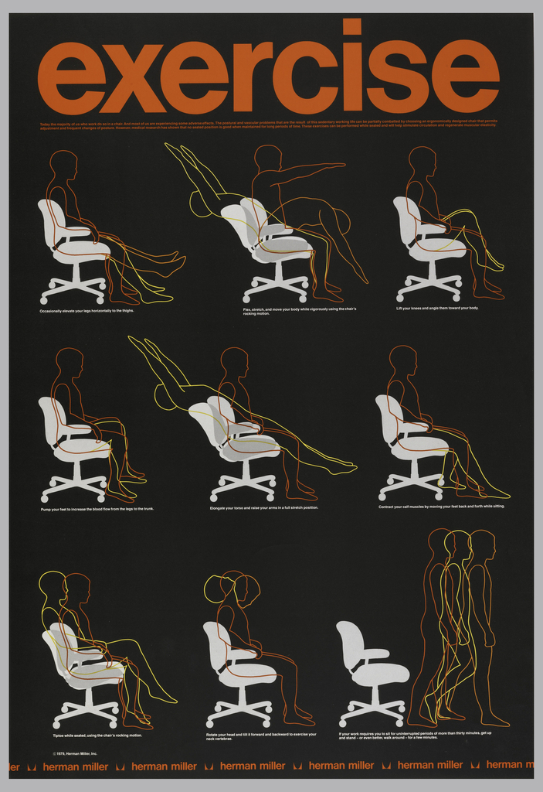

When we originally [released](https://whosonfirst.org/blog/2015/08/18/who-s-on-first/) **Who’s On First**, our gazetteer of all the places in the world from continents to neighbourhoods and venues, we published the open data with the [CC-BY](https://creativecommons.org/licenses/by/4.0/) license. Today we’re providing public notice and requesting comments on a license change to the [CDLA-Permissive 1.0](https://cdla.io/permissive-1-0/) license. 

Our mission at Who’s On First has always to collect great content about places and release it as liberally licensed open data. **We believe that licenses which  encourage data circulation promote a wider range of uses.** Mapzen’s original contributions were added as [CC0](https://creativecommons.org/share-your-work/public-domain/cc0/) and most of our other data sources require attribution or are in the public domain.

Because of the mix of licenses from Who’s On First [sources](https://github.com/whosonfirst/whosonfirst-sources/blob/master/sources/README.md), the minimum common license type for the project needs to be attribution based and we launched with the Creative Commons CC-BY license. An **attribution license also shows respect** for the other open data projects & communities that Who’s On First hold hands with.

After [Mapzen shutdown](https://mapzen.com/blog/shutdown/) we began searching for a new home and new sponsor for the Who’s On First project. We are grateful to have received grant money support from Amazon AWS to keep the data and related cloud machines available in 2018. **Mapzen expats** have landed a variety of places, including at [Snapchat](https://www.snapchat.com/) and at [SFO Museum](https://www.flysfo.com/museum), where we continue to actively contribute to the project. 

### We’re pleased to announce that Who’s On First is in the process of become a [Linux Foundation](https://www.linuxfoundation.org/) project!

The Linux Foundation has a long track record supporting open source software projects and Samsung has been a member of the foundation [since 2012](https://techcrunch.com/2012/06/07/samsung-joins-the-linux-foundation/). 

The move from Mapzen and Samsung to the Linux Foundation will give Who’s On First a permanent and stable home, allowing us to continue the project and build a sustainable community. If you’d like to join the proposed Who’s On First **steering committee** or show **financial support** please get in touch! The change also offers us a moment to consider our data license. 

Generally the CC-BY license has worked well for Who’s On First. But while the intent of the license is clear, there are technical reasons to consider a new license moving forward.

### Enter the Community Data License Agreement – Permissive, Version 1.0 license agreement.

This Linux Foundation authored license was [released in 2017](https://www.linuxfoundation.org/press-release/2017/10/linux-foundation-debuts-community-data-license-agreement/) and is similar to other permissive open source licenses in that the publisher of the data allows anyone to use, modify and do what they want with the data with no obligations to share any of their changes or modifications. 

There are several [benefits](https://cdla.io/faq/) to using **CDLA-Permissive 1.0**:

- CDLA is an attribution based license, meeting our obligations to our sources. The basic attribution statement and license link for the project would remain unchanged:
    -  > Data from Who's On First. [License](https://github.com/whosonfirst-data/whosonfirst-data/blob/master/LICENSE.md).
- CDLA covers the dataset as a whole and individual records, while CC-BY is not optimized for data or databases.
- CDLA unambiguously covers the rights to use and publish the data permissively.
- CDLA establishes the “enhanced data” is not considered a joint authorship. This clearly establishes that mixing our data with data under other licenses is okay, encourages wider circulation of our data, and avoids discussion of collective versus derivative databases.
- CDLA explicitly distinguishes between the data provided under license, which are subject to the CDLA’s terms, and the “results” obtained by processing or analyzing that data without imposing obligations or restrictions on the results. This clearly establishes that the use of Who’s On First in geocoding applications does not pollute the geocoding results.
- CDLA terms outlined above should make it easier for larger institutions and enterprises to more easily interact with the Who’s On First data by removing uncertainty.
- CDLA and Linux Foundation will allow us to continue using our existing tools and workflow to curate and build data together in a similar way to how open source software is developed but tuned to the specific needs of data.
- CDLA is the standard data license used by Linux Foundation for data projects. We’re not obligated to use this license, but for the reasons stated above we’d like to make the switch.

We also plan on enabling the [DCO](https://github.com/apps/dco) **Github app** in all Who’s On First repos to enforce the [Developer Certificate of Origin](https://developercertificate.org/) (DCO) on Pull Requests that change the code, data, and/or documentation. This app requires all commit messages to contain the “Signed-off-by” line with an email address that matches the commit author.

We’d love to hear your feedback on these changes by September 14th either as comments on the [Github issue](https://github.com/whosonfirst-data/whosonfirst-data/issues/1292) or by email to nvkelso@gmail.com.

Images used in this blog post:

    <ul style="margin-top:1em;">
        <li><a href="https://collection.cooperhewitt.org/objects/18637303/">Poster, Exercise, 1979</a>
        <small>Designed by Linda Powell</small></li>
    </ul>

