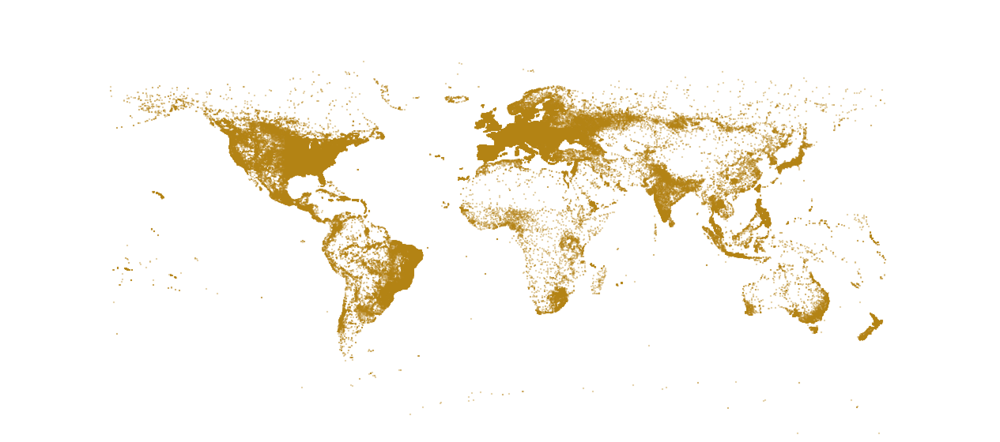
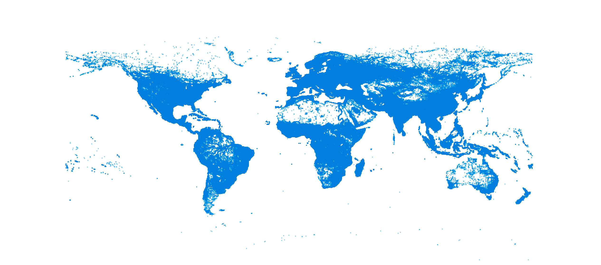

We've spent a great deal of time importing and assessing data quality of new [Who's On First](https://whosonfirst.org/) locality records. More specifically, we've recently imported new locality records sourced from the [GeoNames](https://www.geonames.org/) database.

Prior to this work, we've imported tens of thousands of new county records in Who's On First via [Mesoshapes](https://whosonfirst.org/blog/2016/12/08/mesoshapes/), added properties from [Statoids](https://whosonfirst.org/blog/2017/09/19/introducing-statoids/), and imported smaller amounts of locality records via the Quattroshapes point gazetteer, but we are happy to announce that Who's On First now has comprehensive global coverage at the locality placetype .

Before this work began, the locality record count in Who's On First was just over 345,000. At the completion of this import, the locality record count increased more than ten-fold, to just over 4.4 million records. This locality import increased the total number of administrative records in the [whosonfirst-data repository](https://github.com/whosonfirst-data/whosonfirst-data) to 4.8 million. This detailed coverage at the locality level, in addition to the other placetype updates we've completed, give millions of detailed administrative hierarchies for cities, poplulated places, villages, and towns around the world.

#### Pre-GeoNames import locality coverage visualized:



#### Post-GeoNames import locality coverage visualized:



I'd like to take a few minutes to describe how the GeoNames records were created, show off a few examples of new locality records that were added to Who's On First, and let you know what's next.


## Creating records

For those unfamiliar, the GeoNames database provides various place data under the [CC-BY 4.0](https://creativecommons.org/licenses/by/4.0/) license. Of interest to Who's On First are the [free gazetteer data](http://download.geonames.org/export/dump/) files, specifically the `allCountries.zip` file and the `alternateNames.zip` file, which cover "all countries and contains over eleven million placenames", according to their website. These files contain location, placetype, name translation, and concordance data that we harvested to create new locality records (though we first needed scrub these text files and convert them to CSV files). View the [readme file](http://download.geonames.org/export/dump/readme.txt) for a full list of property descriptions.

### Example contents:

`alternateNames.csv` file:

```
alternateNameId,geonameid,isolanguage,alternate_name,isPreferredName,isShortName,isColloquial,isHistoric
1520975,3900358,,Ainco,,,,
1520976,3900358,,Aucó,,,,
6715191,3900358,,Ahinco,,,,
```

`allCountries.csv` file:

```
geonameid,name,asciiname,alternatenames,latitude,longitude,feature_class,feature_code,country_code,cc2,admin1_code,admin2_code,admin3_code,admin4_code,population,elevation,dem,timezone,modification_date
3038832,Vila,Vila,Casas Vila,Vila,42.53176,1.56654,P,PPL,AD,,03,,,,0,,1318,Europe/Andorra,2012-04-13
```

The text snippets above are what GeoNames stores in these two files for the place of  Ahinco, Chile. A new locality record in Who's On First for [Ahinco, Chile](https://spelunker.whosonfirst.org/id/1226313821/) was created using these same values. A list of these values below, with descriptions from the [GeoNames website](http://download.geonames.org/export/dump/):

```
geonameid         : integer id of record in geonames database
name              : name of geographical point (utf8) varchar(200)
asciiname         : name of geographical point in plain ascii characters, varchar(200)
alternatenames    : alternatenames, comma separated, ascii names automatically transliterated, convenience attribute from alternatename table, varchar(10000)
latitude          : latitude in decimal degrees (wgs84)
longitude         : longitude in decimal degrees (wgs84)
feature class     : see http://www.geonames.org/export/codes.html, char(1)
feature code      : see http://www.geonames.org/export/codes.html, varchar(10)
country code      : ISO-3166 2-letter country code, 2 characters
cc2               : alternate country codes, comma separated, ISO-3166 2-letter country code, 200 characters
admin1 code       : fipscode (subject to change to iso code), see exceptions below, see file admin1Codes.txt for display names of this code; varchar(20)
admin2 code       : code for the second administrative division, a county in the US, see file admin2Codes.txt; varchar(80) 
admin3 code       : code for third level administrative division, varchar(20)
admin4 code       : code for fourth level administrative division, varchar(20)
population        : bigint (8 byte int) 
elevation         : in meters, integer
dem               : digital elevation model, srtm3 or gtopo30, average elevation of 3''x3'' (ca 90mx90m) or 30''x30'' (ca 900mx900m) area in meters, integer. srtm processed by cgiar/ciat.
timezone          : the iana timezone id (see file timeZone.txt) varchar(40)
modification date : date of last modification in yyyy-MM-dd format
alternateNameId   : the id of this alternate name, int
geonameid         : geonameId referring to id in table 'geoname', int
isolanguage       : iso 639 language code 2- or 3-characters; 4-characters 'post' for postal codes and 'iata','icao' and faac for airport codes, fr_1793 for French Revolution names,  abbr for abbreviation, link to a website (mostly to wikipedia), wkdt for the wikidataid, varchar(7)
alternate name    : alternate name or name variant, varchar(400)
isPreferredName   : '1', if this alternate name is an official/preferred name
isShortName       : '1', if this is a short name like 'California' for 'State of California'
isColloquial      : '1', if this alternate name is a colloquial or slang term. Example: 'Big Apple' for 'New York'.
isHistoric        : '1', if this alternate name is historic and was used in the past. Example 'Bombay' for 'Mumbai'.
```

The record for Ahinco, for example, contains three name translations we imported from the GeoNames `alternateNames` file and a latitude and longitude pair that were used to create the record's geometry in the `allCountries` file.

Ahinco is just one of the millions of locality records now in Who's On First. Valuable data for other localities can be found in these files, though not all data in the GeoNames source files is relevant to Who's On First's interests.

Not only did we try to remove any potential duplicate records prior to import, but we needed to filter out non-locality placetypes and ensure we are only introducing new places (not previously known) into Who's On First. A full list of placetype mappings, below:

#### Placetypes

```
    placetype_mapping = {
        "PCL"   : "country",           # political entity
        "PCLD"  : "dependency",        # dependent political entity
        "PCLF"  : "dependency",        # freely associated state
        "PCLH"  : "country",           # historical political entity, CESSATION DATE with today's date, and MZ:IS_CURRENT = 0
        "PCLI"  : "country",           # independent political entity
        "PCLIX" : "region",            # section of independent political entity
        "PCLS"  : "dependency",        # semi-independent political entity
        "PPL"   : "locality",          # basic locality
        "PPLA"  : "locality",          # region capital
        "PPLA2" : "locality",          # county capital
        "PPLA3" : "locality",          # localadmin capital
        "PPLA4" : "locality",          # localadmin capital
        "PPLC"  : "locality",          # country capital
        "PPLF"  : "locality",          # farm village
        "PPLG"  : "locality",          # seat of government of a political entity
        "PPLH"  : "locality",          # historical populated place, CESSATION DATE with today's date, and MZ:IS_CURRENT = 0
        "PPLL"  : "locality",          # populated locality
        "PPLQ"  : "locality",          # abandoned populated place, CESSATION DATE with today's date, and MZ:IS_CURRENT = 0
        "PPLR"  : "locality",          # religious populated place
        "PPLS"  : "locality",          # populated places
        "PPLW"  : "locality",          # destroyed populated place, CESSATION DATE with today's date, and MZ:IS_CURRENT = 0
        "PPLX"  : "neighbourhood"
    }
```

As you can see in the key/value pairing above, there are twenty two placetype mappings from GeoNames to Who's On First (not all map to localities). This was the first step to identifying relevant records and filtering out places that we did not want to import new records for.

#### Historical placetypes
```

    placetype_historical = {
        "ADM1H",
        "ADM2H",
        "ADM3H",
        "ADM4H",
        "ADMDH",
        "PCLH",
        "PPLH",
        "PPLQ",
        "PPLW"
    }
```

Next, we created a lookup table to identify historical localities. This is important, as both GeoNames and Who's On First have a concept a historical places; identifying localities that have been deprecated, ceased to exist, or "historical" for another reason, let's us tag these records as such during our import.

After filtering out non-locality placetypes and comparing the remaining records with existing records (through existing concordances and various spatial join methods), we iterated through the two import files to craft new GeoJSON-formatted records for Who's On First.

These records need a few additional properties before being imported, though. These properties include:

- **A new, unique [`wof:id`](https://github.com/whosonfirst/whosonfirst-properties/blob/master/properties/wof/id.json) (we minted roughly four million new identifiers from [Brooklyn Integers](https://www.brooklynintegers.com/))**
- **A [`wof:parent_id`](https://github.com/whosonfirst/whosonfirst-properties/blob/master/properties/wof/parent_id.json) property**
  - _This was defaulted to a `-1` value as a placeholder, though this value will change as updates to records occur._
- **A ['mz:is_current'](https://github.com/whosonfirst/whosonfirst-properties/blob/master/properties/mz/is_current.json) property**
- **A ['wof:name'](https://github.com/whosonfirst/whosonfirst-properties/blob/master/properties/wof/name.json) property, sourced from the GeoNames `asciiname` value**
- **Country code values**
- **A [`src:geom`](https://github.com/whosonfirst/whosonfirst-properties/blob/master/properties/src/geom.json) property to indicate these geometries are sourced from GeoNames**
- **Any new concordance values**
- **Any [`edtf`](https://github.com/whosonfirst/whosonfirst-properties/blob/master/properties/edtf) properties, as necessary**
- **Various population indicators, if GeoNames maintains population data for a given place**
- **And finally, top-level [GeoNames](https://github.com/whosonfirst/whosonfirst-properties/blob/master/properties/gn) properties**

```
  - _wof property_ = _gn property_
  - `gn:geonameid` = geonameid
  - `gn:name` = name
  - `gn:asciiname` = asciiname
  - `gn:latitude` = latitude
  - `gn:longitude` = longitude
  - `gn:feature_class` = feature_class
  - `gn:feature_code` = feature_code
  - `gn:country_code` = country_code
  - `gn:cc2` = cc2
  - `gn:admin1_code` = admin1_code
  - `gn:admin2_code` = admin2_code
  - `gn:admin3_code` = admin3_code
  - `gn:admin4_code` = admin4_code
  - `gn:population` = population
  - `gn:elevation` = elevation
  - `gn:dem` = dem
  - `gn:timezone` = timezone
  - `gn:modification_date` = modification_date
```

These properties (along with the GeoNames-sourced properties) gave us the building blocks to then export this GeoJSON file using the handy [exportify tool](https://github.com/whosonfirst/py-mapzen-whosonfirst-export/blob/master/scripts/wof-exportify) to create and validate a Who's On First record with the minimum viable properties.

Since Who's On First bakes the idea of a place's hierarchy into a record's property, we used a point-in-polygon (PIP) service (some notes about that [here](https://github.com/whosonfirst/whosonfirst-cookbook/blob/master/how_to/setting_up_pip_service.md)) to update each new record's hierarchy.

In the case of Ahinco, Chile, this allows Who's On First to store a full administrative hierarchy for this locality (see below).

```
    "wof:hierarchy":[
        {
            "continent_id":102191577, (South America)
            "country_id":85633057, (Chile)
            "region_id":85682233, (De Los Lagos)
            "county_id":102063135, (Llanquihue)
            "locality_id":1226313821 (Ahinco)
        }
    ],
```

### Other examples

This work is not limited to Chile, like the Ahinco example above. Other examples of new locality records include [Abeikeng](https://spelunker.whosonfirst.org/id/1225865875/), a locality in [Fujian](https://spelunker.whosonfirst.org/id/85669735/), [China](https://spelunker.whosonfirst.org/id/85632695/) and 
[Zela](https://spelunker.whosonfirst.org/id/1360321381/), a locality in [Metekel](https://spelunker.whosonfirst.org/id/1108695191/), [Ethiopia](https://spelunker.whosonfirst.org/id/85632257/).

In fact, prior to the GeoNames work, Who's On First maintained zero records at the locality placetype within Metekel, Ethiopia. This work added forty seven new locality records - like [Debre Zeyit](https://spelunker.whosonfirst.org/id/1210052931/)
 and [Dibate](https://spelunker.whosonfirst.org/id/1277019105/). Here are the new locality descendants of Metekel, Ethiopia, visualized:


## Next steps

While this import of new locality records added a tremendous amount of new data to Who's On First, there is additional work to be completed. In some cases, GeoNames has a property flag that has been used inconsistently or a record has been misclassified as a locality when in Who's On First it should actually be stored at the neighbourhood placetype.

Additionally, the `gn:` properties in many of these records will be scrubbed to ensure Who's On First correctly stores source values. Eventually, the concordance values in any new locality record will be used to add more information about each place as possible (adding more names from Wikipedia, for example).

Lastly, as mentioned in [our recent blog post](), the Who's On First data gazetteer has now been split into per-country repositories and distribution files because of the repository's size and scale. The GeoNames locality records are still present in these per-country repositories and distribution files.

If you have any suggestions on how to improve data quality, please feel free to [drop us a line](https://github.com/whosonfirst-data/whosonfirst-data/issues).

## Conclusion

By importing the millions of locality records from GeoNames into Who's On First, we've added the most detailed and comprehensive locality coverage available to Who's On First.

Although there were various constraints along the way to importing such a large dataset, the end result as been a increase in detail at the locality level. Our goal is to provide this coverage to users of Who's On First; coupled with the previous work at other placetypes, we hope that you're able to enjoy the new additions.


_Photo Credit: [Paul Sableman, flickr](https://www.flickr.com/photos/pasa/15891216909/in/photolist-qdfD9r-7EXjUH-6jT6jo-fD5xU7-8fEErJ-9ADygi-4YsWRt-rTmN-7UxFvd-brxPcD-f682yx-6CVHMS-4YsX8M-2vBtmc-oiZ7Qr-fD5zx3-qouxiV-6umM3w-fD5vHy-59M6Q7-2V4DEg-afXdPv-27BgvcM-9TGSQY-27TSkdM-brxLa4-a1jVAW-Qj7nax-2frphda-qx7M9q-qouwev-5WHZMm-tW7FY-brxM8g-7mU5AB-URGwB6-htZry4-V8budP-r3QJ26-e9YHw-broUxe-62hjSC-tW7B6-8K1Pht-f682Ai-5sDZek-8N5z8H-bt428R-gnUFB9-fD5nBL)_
